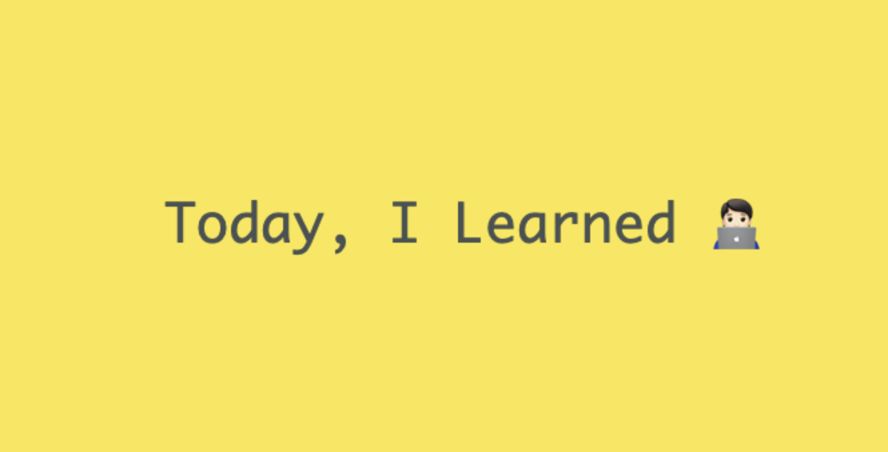

Well begun is half done.

## Web
* [쿠키(Cookie)란 무엇인가](Web/cookie.md)
* [세션(Session)란 무엇인가](Web/session.md)

## Docker
* [도커를 사용하는 이유](Docker/docker1.md)

## Spring
* [스프링의 핵심 원리](Spring/Spring.md)
* [좋은 객체 지향 설계의 5가지 원칙](Spring/solid.md)
* [생성자 주입을 선택해라](Spring/constructor.md)
